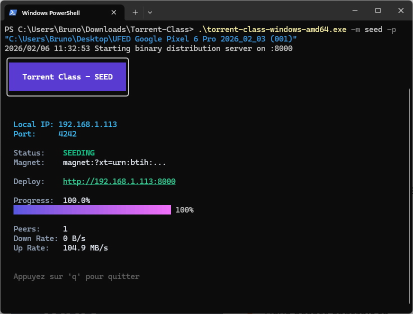
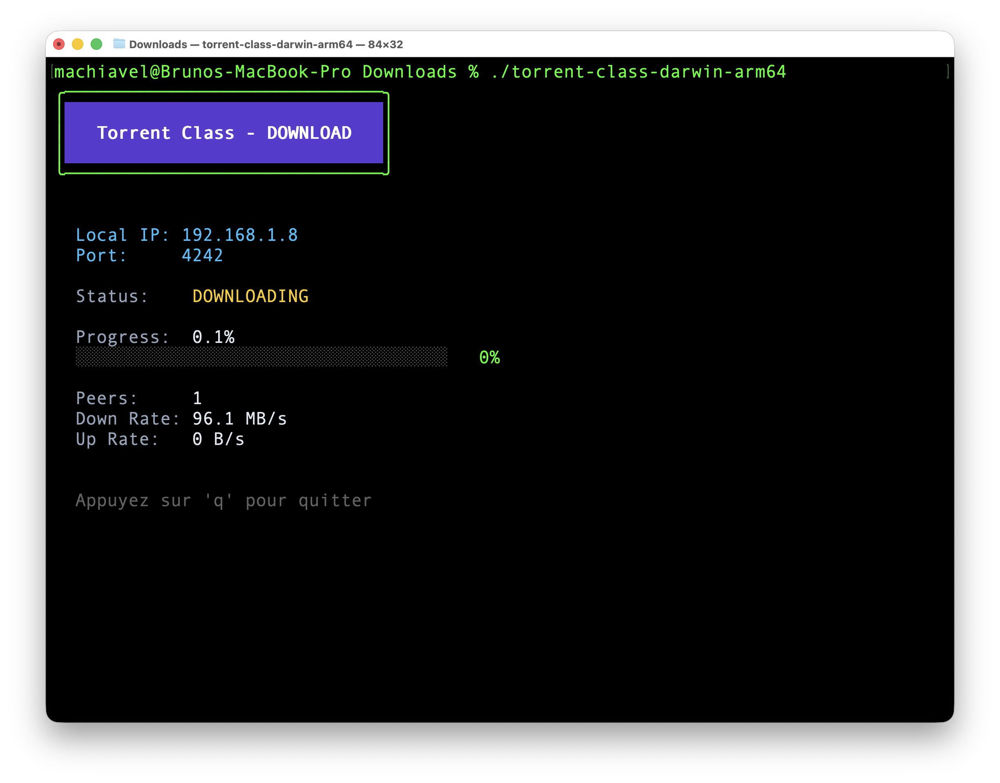

# Torrent Class

A lightweight, local-network peer-to-peer file distribution system built with Go and the BitTorrent protocol.

## Features

- **Local Discovery**: Automatic peer discovery on local networks via UDP broadcast.
- **No Dependencies**: Works without central trackers or DHT for local-only operation.
- **High Performance**: Built on top of the robust `anacrolix/torrent` library.
- **Premium TUI**: A sleek terminal user interface for monitoring transfers.
- **Self-Distribution**: Built-in HTTP server for easy binary deployment across machines.

## Previews

| Seeding (Windows) | Downloading (macOS) |
|:---:|:---:|
|  |  |

## 📖 Documentation

- **[User Guide](docs/USER_GUIDE.md)**: Simple steps for students and instructors.
- **[Technical Guide](docs/TECHNICAL.md)**: Deep dive into the P2P engine and discovery protocol.

## Download

You can download the latest compiled binaries for your platform from the [Releases](https://github.com/your-repo/releases) section.

### Binary Naming Convention

Binaries are named following this pattern:
`torrent-class-<platform>-<architecture>[.exe]`

Examples:
- `torrent-class-windows-amd64.exe`
- `torrent-class-darwin-arm64` (MacOS)
- `torrent-class-linux-amd64`

## Getting Started (Developers)

If you want to build from source:

### Prerequisites

- Go 1.25.6 or higher.

### Installation

1. Clone the repository:
   ```bash
   git clone <repository-url>
   cd torrent-class
   ```

2. Install dependencies:
   ```bash
   go mod download
   ```

### Compilation

To build for your current platform:
```bash
go build -o torrent-class ./cmd/distributor
```

### Build Automation

To cross-compile binaries for the main supported platforms (Windows, Linux, macOS):
```bash
go run scripts/build.go
```
The compiled binaries will be saved in the `releases/` folder.

## Usage

Torrent Class can be run in two modes: `seed` and `download`.

#### Seeding a File/Folder

To share a file or a whole directory, run the binary:

```bash
./torrent-class-linux-amd64 -m seed -p <path-to-file-or-folder>
```
*(On Windows, use `.\torrent-class-windows-amd64.exe`)*

When seeding, the application automatically starts an HTTP server (default port 8000) so you can distribute the binary to other machines via their web browser.

#### Downloading (Default)

To download a file broadcasted on the network, you can simply run it without flags (or specify a destination path):

```bash
./torrent-class-linux-amd64 -p <destination-directory>
```

The application will automatically find the instructor and start the download.

## CLI Flags

- `-m`, `--mode`: `seed` or `download` (default: `download`)
- `-p`, `--path`: Path to file/folder to seed or download to (default: `.`)
- `-i`, `--ip`: Manually specify the local IP to broadcast (optional)
- `-l`, `--listen`: Port for BitTorrent listening (default: `4242`)
- `-x`, `--magnet`: Magnet link for download mode (optional)
- `-s`, `--http-port`: Port for the HTTP distribution server (default: `8000`)

## Project Structure

- `cmd/distributor`: Main entry point and CLI logic.
- `pkg/discovery`: Implementation of the UDP broadcast protocol for peer discovery.
- `pkg/engine`: Torrent handling and peer management.
- `pkg/tui`: Terminal user interface using Bubble Tea and Lip Gloss.
- `.torrent.bolt.db`: (Auto-generated) Local database for torrent metadata and peer cache.

## Protocol Details

The system uses a custom UDP broadcast protocol for discovery on port 4243. This allows clients to immediately establish TCP connections for data transfer without external infrastructure.
