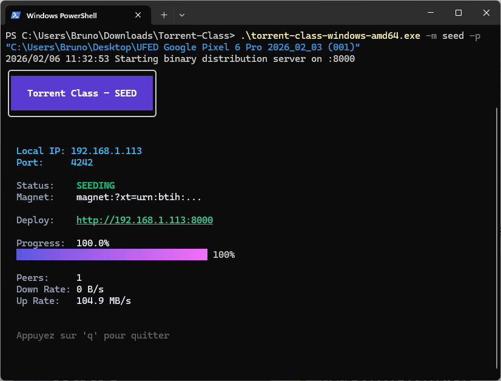
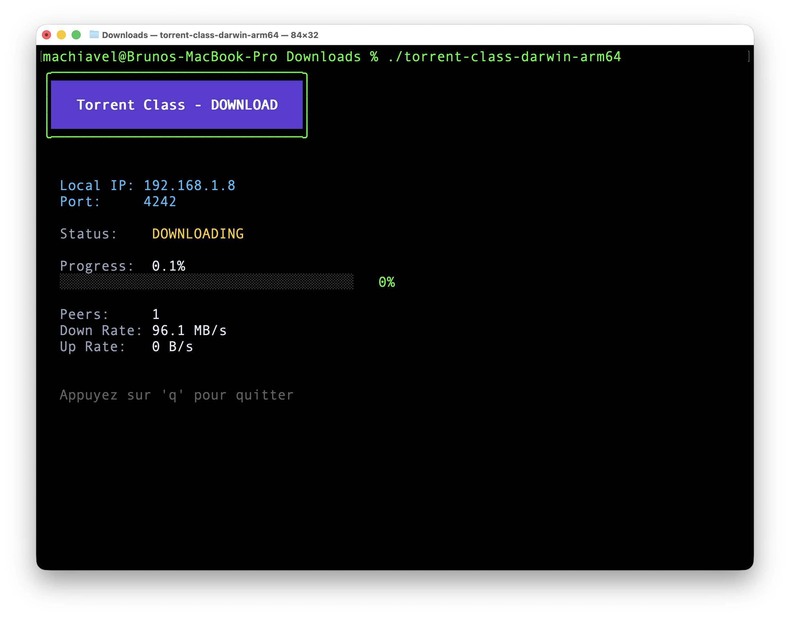

# Torrent Class

A lightweight, local-network peer-to-peer file distribution system built with Go and the BitTorrent protocol.

## Features

- **Double-Click Experience**: Run the program without flags to be guided by native popups.
- **Hybrid Discovery**: Automatic peer discovery on local networks via UDP broadcast with an **HTTP fallback** and built-in **Network Adapter Selector**.
- **No Dependencies**: Works without central trackers or DHT for local-only operation.
- **Viral Seeding**: Downloaders automatically help share parts with others.
- **Premium TUI**: A sleek terminal user interface for monitoring transfers.

## Previews

| Seeding (Windows) | Downloading (macOS) |
|:---:|:---:|
|  |  |

## Getting Started

### 1. Download
Grab the latest binary for your platform from the [Releases](https://github.com/MrNonoss/torrent-class/releases) section.

### 2. Usage (Interactive Mode)
Simply **double-click** the binary (or run it without flags). 
- Select **Seed** to share a file or folder.
- Select **Download** to start receiving files. You will be asked if you want **Automatic** (UDP) or **Manual** (IP) discovery.
- **Adapter Selection**: If multiple network adapters are found, you will be prompted to choose the correct one.
- **Automatic Folder Isolation**: When seeding, the tool creates a `shareable_YYYY-MM-DD` folder and copies itself there for a clean distribution experience.
  > [!TIP]
  > **Sharing additional files**: You can paste any other files (documents, datasets, codes) into this folder before or after starting the tool. Students will see them in their browser and can download them directly!
- If automatic discovery fails, the app will prompt for the Instructor's IP after 25 seconds.

### 3. CLI Mode (Advanced)
For scripts or specific configurations, use command-line flags:

```bash
# Seed a folder
./torrent-class -m seed -p path/to/folder

# Download to a specific folder
./torrent-class -p path/to/destination
```

**Common Flags:**
- `-m`, `--mode`: `seed` or `download` (default: `download`)
- `-p`, `--path`: Path to file/folder to seed or destination path.
- `-s`, `--seeder`: Directly specify the Instructor's IP (e.g., `-s 192.168.1.10`).
- `-i`, `--ip`: Manually specify your local IP/Adapter if needed.
- `-c`, `--max-conns`: Max simultaneous connections (default: 200).
- `-b`, `--bit-port`: Override the Bittorrent P2P port (default: 8081).
- `-l`, `--http-port`: Override the HTTP distribution port (default: 8000).

## Network Requirements

> [!IMPORTANT]
> **All machines must be on the same Local Subnet.** Peer discovery primarily relies on UDP broadcast.
> 
> **Restricted Networks**: If you are on a corporate network where UDP is blocked, Torrent Class will automatically fallback to **HTTP Retrieval** after 25 seconds. You can also use "Manual Mode" at startup to enter the seeder's IP directly.

### Multiple Network Adapters
If your machine has multiple adapters (Wi-Fi, Ethernet, Virtual Machines):
1. **Interactive Selection**: Run without flags, and the tool will automatically detect multiple adapters and ask you to pick the one to use.
2. **Check the TUI**: The app lists all "Detected Adapters" with their names (e.g., Wi-Fi, eth0). Ensure the **Local IP** (shown in magenta/red) matches the network your students are using.
3. **Override if necessary**: If you are using the CLI and the app selects the wrong adapter, use the `-i` flag to force it:
   ```bash
   ./torrent-class -i 192.168.1.15
   ```

## Documentation

- **[Technical Guide](docs/TECHNICAL.md)**: Details about the P2P engine and discovery protocol.
- **[Build Guide](docs/BUILD.md)**: Instructions for developers building from source.

## Dependencies

- `github.com/anacrolix/torrent`: Core P2P engine.
- `github.com/charmbracelet/bubbletea`: TUI framework.
- `github.com/charmbracelet/bubbles`: TUI component library (Progress Bar).
- `github.com/charmbracelet/lipgloss`: Terminal layout and styling.
- `github.com/ncruces/zenity`: Native GUI dialogs.
- `github.com/mattn/go-isatty`: Terminal capability detection.
